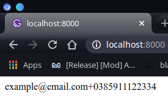

## Upute i predgovor (počitati)
Ovo su prve vježbe s kojima započinjemo izradu web stranice unutar ovog kolegija.<br/>
<p align="center">
  
</p>

Svaka od vježbi podjeljena je u **git branch** i završetkom svake vježbe radimo *merge* na *master* branch gdje ćemo na kraju imati dovršenu stranicu. Svaka funkcionalna promjena bit će spremljena u **git commit**. U sklopu svakog brancha bit će napravljen segment stranice (npr. navigacija, dio sadržaja i sl.) i bit će objašnjen koncept Reacta. Ideja je da nakon odrađenih vježbi budemo upoznati sa svim bitnim konceptima Reacta i da dobije "odskočna daska" s koje možete početi raditi vlastite projekte. U sklopu prve vježbe napravit ćemo navigacijski header i objasniti kako radi **export / import i styling.**

### Pregled stranice
Većina stranica u modernom *web*-dizajnu sastoje se od:
- headera u kojem je najčešće i navigacijska traka
- naslovnog dijela (ne uvijek, ali često)
- sadržaja stranice
- footera sa kontakt informacijama, pravnim podatcima i linkovima na društvene mreže.

Stranica koju izrađujemo prati taj format.
<p align="center">
  
</p>

Kroz vježbe koje sljede izradit ćemo stranicu segment po segment počevši od **Headera**. Za početak, pokrit ćemo neke ključne React koncepte za ovu vježbu.

Krenimo!

## React concepts: Export / Import i Styling
U prvim vježbama poć ćemo kroz *import* i *export* naredbe za rad sa bibliotekama, vlastitim i vanjskim. Zatim prelazimo na ispravan način stiliziranja koponenti.
### Import / Export
**Import** i **Export** se koriste za referenciranje objekata i funkcija između različitihh JavaScript datoteka. *Import* je ekvivalent **#include** direktive u C jeziku. *Export* definira što se može uvesti sa *Import* naredbom. Pogledajmo primjer:
```javascript
// unutar say.js datoteke
function sayHi(user) {
  console.log(`Hello, ${user}!`)
}

function sayBye(user) {
  console.log(`Bye, ${user}!`)
}

function sayNop(user) {
  console.log(`Nope, ${user}, won't work!`)
}

export {sayHi, sayBye}
//
/************************/
//
//unutar main.js datoteke u istom folderu
import {sayHi, sayBye} from './say.js'
sayHi('Ante')
// Hello, Ante!
sayBye('Mate')
// Bye, Mate!
sayNope('Jure')
// error: sayNope is not a function
```
*Export* smo pozvali nad novim objektom kojem smo pridružili *sayHi* i *sayBye*, ali mu **nismo** pridruzili *sayNope* iako smo ga definirali unutar datoteke. Poziv te varijable dat će runtime error jer nije definirana (točnije, nismo je otkrili za *Import*).

Sad kad je opći koncept jasan, pokrit ćemo različite načine *import / export* naredbi.

#### Po variabli

Možemo exportat varijable jednu po jednu prilikom definicije. Onda, kao u primjeru iznad, možemo importat varijable koje želimo:
```javascript
// say.js
export function sayHi(name) { ... }
export const say = (what, toWhom) => { ... } 
export const thisIsAConstValue = "I will never change"
//
/***************/
//
//main.js
import {say, thisIsAConstValue} from './say.js'
say(thisIsAConstValue, 'Ante')
// I will never change, Ante
```
Primjetite dva načina definiranja funkcije. Poželjno je naviknuti se na lambda način (=>). <br/>
Ime varijable u ovom primjeru izgleda dosta nezgrapno. Za to možemo koristiti **as** ključnu riječ:
 ```javascript
// say.js
export function sayHi(name) { ... }
const say = (what, toWhom) => { ... }
export const thisIsAConstValue = "I will never change"

export {say as s}
//
/***************/
//
//main.js
import {s, thisIsAConstValue as constVal} from './say.js'
s(constVal, 'Ante')
// I will never change, Ante
```

#### default export
Postoji i **default** *export / import*. Dosta se često koristi u Reactu za *export* komponenti. *Export* definiran kao *default* je onaj koji se koristi ako se ne definira varijable koja se uvozi.
Primjer:
```jsx
// components/component/index.js
export const constant = 10 

const Component = () => {
  <div>
    <p>This is a constant {constant} </p>
  </div>
)

export default Component
```
```jsx
import myComponent, {constant} from './components/component' 
// ako postoji index.js on se uzima automatski 
// pa nije potreban u pathu iznad
// Primjetimo da myComponent nije u {} znači da je on *default* export
// Konvencija je da je componenta uvjek default i da se koristi isto ime
// Znači alternativa verzija naredbe je:
// import Component, {constant} from './components/component'/index.js 

const HigherComponent = props => {
  // logika i definicije
  /*
  .
  .
  .
  */
 return (
   <div>
    ...
      <myComponent />
    ...
  </div>
 )
}

export default HigherComponent
```
[Izvor](https://javascript.info/import-export) i [reference](https://developer.mozilla.org/en-US/docs/Web/JavaScript/Reference/Statements/export). ES6 [službena finalna sintaksa](https://2ality.com/2014/09/es6-modules-final.html)

### Styling sa CSS modulima
Do sad smo se upoznali sa inline stilovima pomoću `style` atributa.
Sad kad budemo pisali "ozbiljan" kod nećemo više tako raditi. Koristit ćemo `.css` datoteke za definiranje stilova komponenti. Razlika je što će svaka komponenta imati svoj `.js` i `.css` dio. Kod pisanja statičkih stranica čistim HTML-om i CSS-om, pišemo jedan više CSS datoteka koji onda djeluju globalno na stranici. Što znači da moramo paziti da se ime klase ne ponovi u definiciji CSS-a, također bitan je poredak klasa i hiearhija inače se klase neće ispravno primjenit (pa se pribjegava zloglasnoj **!important** direktivi). 

Kod pristupa definicije po komponenti nemamo tih problema. Svaka *.css* datoteka vidljiva je samo toj koponenti, to je tkz "component scoped style". Takav pristup stiliziranju naziva se **modularan** pristup pa se takve `.css` datoteke nazivau **css moduli**. React nije oduvijek podržavao CSS module, ali sada su dio standarda i često se koriste.
#### Cilj i svrha
Cilj modularnog pristupa je uvjek isti: razbijanje na koponente zbog lakšeg snalaženja, pisanja i održavanja koda. Poanta je postići da svaka koponenta ima svoju logiku i izgled definiranu u JavaScriptu, a stil definiran u css datoteci. Problem koji nastaje je taj što css uvjek djeluje na cijeli HTML dokument što znači da će postojati kolizija u imenovanju kalasa. Ako imamo klasu koja se zove `button` i mjenjamo je unutar `.css` datoteke i imamo više *button* elementa unutar HTML dokumenta, svi oni će biti pogođeni promjenom. Ako to radimo unutar `.module.css` datoteka, bit će pogođeni samo elementi unutar te koponente. To se naziva **style scoping**.

Sa css modulima osigurava se da:
- definicije dijeluju samo na dotičnu komponentu i drugo ništa. 
- definicije stilova za tu koponenetu su dane na jednom mjestu.

[Izvor](https://css-tricks.com/css-modules-part-1-need/) <br/>
[Još jedan izvor](https://glenmaddern.com/articles/css-modules)
#### Implementacija
*css* moduli se definiraju posebnim nazivom datoteke, a to je **.module.css**. Dakle, ako css datoteka u svom nazivu sadrži *.module.css*, ta datoteka je css modul.
Moguće je koristiti i jedno i drugo, a bitna razlika je što datoteke koje nisu moduli dijeluju na **cijeli HTML dokument**.<br/>
Pogledajmo sljedeći primjer:
 <p align="center">
  
</p>

Za to definiramo css: `style.module.css`
```css
/* components/style.module.css */
.normal { /* all styles for Normal */ }
.disabled { /* all styles for Disabled */ }
.error { /* all styles for Error */ }
.inProgress { /* all styles for In Progress */
```
```jsx
/* components/submit-button.jsx */
import React from 'react';
import styles from './style.module.css';

const Button = ({ 
  submissionInProgress, 
  errorOccured, 
  isValid })
  => {
    let className = '' 
    let text = "Submit"
    if (submissionInProgress) {
      className = styles.inProgress
      text = "Processing..."
    } else if (errorOccurred) {
      className = styles.error
    } else if (!isValid) {
      className = styles.disabled
    } else {
      className = styles.normal
    }
    return <button className={className}>{text}</button>
}
```
Imena css klasa su postala polja objekta `styles` kojeg importamo iz `style.module.css` datoteke. Ako malo stanemo i razmislimo o tome, to je dosta impresivno. Sad imamo jednostavno grananje gdje pridružimo odgovarajući `class` s obzirom na stanje botuna (`inProgress`, `errorOccured`...).
Iako istu stvar možemo napraviti sa običnom CSS datotekom, razlika je što ako imamo neki drugi element negdje u HTML koji ima `class` npr. `disabled` kao u primjeru, on će također biti pogođen našom definicijom unutar ove koponente. To je bito razlikoavti.
#### Ispod haube (za znatiželjne)
Način na koji CSS moduli rade je dosta banalan. Prije nego se kod ubaci u HTML dokument, sve klase definirane kao *.module.css* se randomiziraju. Na primjer, ako imamo klasu `.normal` unutar CSS modula, i dodamo je nekom `<button>` elementu, u HTML-u ćemo imat zanimljiv output:
```jsx
import React from 'react'
import styles from 'styles.module.css'

const SomeButton = () => {
  <div className='global-class-name'>
    <button className={styles.normal} >
      <span>This is button text</span>
    </button>
  </div>
}
```
=> Webpack => Gatsby uz ReactJS => HTML/CSS/JS:
```HTML
...
  <div class='global-class-name'>
    <button class='components_some_button__normal__abc5436' >
      <span>This is button text</span>
    </button>
  </div>
...
```
Ime kalse na kraju postaje `components_some_button__normal__abc5436`. Ovaj naziv osigurava da nema kolizije sa drugim klasama koje se zovu `normal`. Na ovaj način dolazi do iluzije da naša modulirana klasa djeluje samo na jednu komponentu. CSS i dalje djeluje globalno, ali iako klase imaju ista imena u našim komponentima, randomizacija osigurava da finalna imena klasa budu drugačija.

Primjetimo da `global-class-name` ostaje isti jer nije modul te se zaista definira globalno.

#### Compose, Inheriance i SASS
God Bless SASS!

## Segment stranice: Header / Navigation
 <p align="center">
  
</p>

Radimo navigaciju prikazanu iznad. Vidimo da se može podjelit na komponente kako slijedi: <br/>
 <p align="center">
  
 </p>

 Kontakt traka i naslovna traka: **React koponente** <br/>
 Logo i navigacija: **React podkoponente**<br/>
 string jedinice unutar koponenti, mogu se prikazat kao `<span>`

### Commit 1: "project clean up"
Kad tek otvorimo *gatsby* projekt, vidimo da je dio koda već napisan. Taj kod napisan je za demo stranicu na `localhost:8000`. Sada ćemo izbrisat sav kod koji nam ne treba unutar `src` foldera.

Unutar `components` brišemo sve datoteke i ostavljamo prazan folder (inače ostavljamo `seo.js` jer pruža [SEO](https://searchengineland.com/guide/what-is-seo), ali budući da su ovo vježbe nećemo se zamarati time).

U `images` možemo izbrisati astronauta, icon ostavimo (potreban je za error msg). Ništa se ne mjenja ako ne brišemo ništa.

Unutar `pages` brišemo sve osim `index.js` i `404.js`.

Primjetit ćemo da se live server na `localhost:8000` sada ruši. Razlog je što smo obrisali neke od datoteka koje on koristi. Sad trebamo izbrisati i njihovu uporabu.

Otvorimo `pages/index.js`. Na vrhu datoteke vidimo da uvozimo sada izbrisani `Layout` i `seo` iz `components`. Izbrisat ćemo to i zamjenit početni sadržaj nekim svojim HTML kodom. Npr:
```jsx
import React from "react"

const IndexPage = () => (
  <main>
    <h1>Hi people</h1>
    <p>Welcome to your new Gatsby site.</p>
    <p>This is were we will add content</p>
  </main>
)

export default IndexPage
```
I sad `404.js` na sličan način.
```jsx
import React from "react"

const NotFoundPage = () => (
    <div>
      <h1>ayy... nothing here!</h1>
      <p>You just hit a route that doesn&#39;t exist...
        the sadness.</p>
    </div>
)

export default NotFoundPage
```
Sam sadržaj nije bitan. Bitno je ukloniti reference na izbrisane datoteke.

Sada server na `locahost:8000` treba raditi normalno. Ako sve radi u redu, sad ćemo napraviti `git commit` od ovih promjena.
Pišemo sljedeće naredbe: <br/>
```bash
$ git add .
$ git commit -m "project clean up"
```
`-m` definira poruku vezanu uz trenutni `commit`. Ako je sve prošlo u redu, sa `git log` možemo vidjet svoj commit i poruku.
<p align="center">
  
</p>

> git komentar: svaki commit mora biti funkcionalan! To znači da ne smijemo napraviti commit ako stranica ne radi kako treba tj. ima neki error. Ukoliko moramo commitat kod koji je nedovršen ili pokvaren dobra praksa je to napomenut sa WIP ili BROKEN u commit poruci. Na primjer: "WIP: adding login page".

### Commit 2: "adding header contact bar"
Sad kećemo sa pisanjem stranice. Prvo ćemo radit kontakt traku na vrhu stranice:
<p align="center">
  
</p>

Sastoji se od jednog `<div>` containera, dva `<span>` elementa i 2 ikonice. Za sad ćemo zanemariti ikonice.
Realizirat ćemo je u 3 koraka:
- Stvorit ćemo komponentu `ContactBar` u `components` folderu
- Sastoji se od `index.js` i `sytle.module.css` datoteka
- Importat ćemo `ContactBar` u `pages/index.js`

 Krenimo sa stvaranjem foldera `contactBar` u `components` folderu. Dodajmo `index.js` datoteku i `style.modules.css` datoteku.
<p align="center">
  
</p>

`index.js` sadržava izgled i logiku (logike nema u ovom slučaju), a `style.module.css` stil. `index.js`:
```jsx
import React from 'react'

const ContactBar = () => (
    <main>
        <span>example@email.com</span>
        <span>+0385911122334</span>
    </main>
)

export default ContactBar
```
Sad je potrebno prikazat ovu koponentu u stranici. Zato idemo u `pages/index.js` i radimo **import**<br/>
`pages/index.js`:
```jsx
import React from "react"

import ContactBar from '../components/contactBar'

const IndexPage = () => (
  <main>
    <ContactBar />
  </main>
)

export default IndexPage
```
Primjetimo import path (`../components/contactBar`) koji pokazuje na našu koponentu. Budući da je path folder, automatski se importa "index.js" datoteka. Ukoliko ona ne postoji potrebno je navesti ime *.js* datoteke (npr. za `main.js` bit će `../components/contactBar/main.js`). U `pages/index.js` datoteku ćemo samo nizati koponente i prikazivati ih. Sada u browseru na `localhost:8000` možemo vidjeti ovo:
 <p align="center">
  
</p>

Ne izgleda impresivno. Dodajmo kod u `style.module.css` pa ćemo napravit *import* stila u `index.js`. `style.module.css`:
```css
.container {
    background-color: #333333;
    height: 35px;
    display: flex;
    justify-content: flex-end;
}

.container span {
    margin: 10px 20px;
    font-size: 12px;
    color: #ccc;
    font-family: 'Helvetica';
}
```
Dodajmo sad ".container" u `index.js`:
```jsx
import React from 'react'
import styles from './style.module.css'

const ContactBar = () => (
    <main className={styles.container}>
        <span>example@email.com</span>
        <span>+0385911122334</span>
    </main>
)

export default ContactBar
```
U browseru bismo trebali vidjeti sljedeće:
 <p align="center">
  
</p>

Done! Možemo commitat promjene:
```bash
$ git add .
$ git commit -m "adding header contact bar"
```
> git komentar: ovaj commit se mogao razbiti u 3 commita: dodavanej index.js, dodavanje .css i na kraju import u page/index.js. Jedan commit je jednostavi demostracije radi. Preporuka je da se commita često i da se commitovi sastoje od svega 10ak linija koda ili manje. Dakle puno malih commitova, ne par velikih.
### Commit 3: "adding global css definitions"
Posljednji commit u ovoj vježbi. U ovom commitu pokazat ćemo kako dodati globalne stilove i definicije u gatsby projekt. Često u projektima ne želimo da pojedini browseri definiraju svoje "browser specific" stilove, nego želimo uniformno iskustvo naše stranice neovisno o browseru kojeg korisnik ima. To postižemo definiranjem default parametra HTML elemenata. Želimo definirati jedan CSS koji će se primjeniti globalno na stranici i unutar kojeg ćemo izbaciti ukrase za `<nav>` i `<ul>`, izbaciti automatske margine i padding za body, definirati fontove za cijeli projekt i slično. Jedan takav CSS file možete naći [ovdje](https://github.com/n00ne1mportant/PublicFilesRepo/blob/master/global.css). To je upravo globalni CSS file kojim se koristi gatsby.

Mi ćemo dodati svoj dosta jednostavniji file u dva koraka:
- definirat ćemo taj CSS file (duh)
- importat ćemo ga u gatsby direktno koristeći gatsbyev API: **gatsby-browser.js**

Definirajmo `global.css` za početak. Lokacija datoteke je proizvoljna, a ja ću izabrati `/src/globlas/global.css`. Stvaramo folder i datoeku:
```css
html {
  font-family: sans-serif;
  -ms-text-size-adjust: 100%;
  -webkit-text-size-adjust: 100%;
}
body {
  margin: 0;
  -webkit-font-smoothing: antialiased;
  -moz-osx-font-smoothing: grayscale;
}
a:active,
a:hover {
  outline-width: 0;
}
article,
aside,
details,
figcaption,
figure,
footer,
header,
main,
menu,
nav,
section,
summary {
  display: block;
}
```
To će biti dovoljno, više [ovdje](https://github.com/n00ne1mportant/PublicFilesRepo/blob/master/global.css). Sad radimo import. Tražimo **gatsby-browser.js** datoteku i samo dodamo sljedeću liniju:
`import './src/globals/global.css'`<br/>
Sad će se `global.css` primjenit nad cijelim dokumentom. Na ovaj način možemo jasno vidjet kako se koristi `module.css` zajedno sa globalnim CSS-om.

Commitajmo ove promjene:
```bash
$ git add gatsby-browser.js
$ git add src/global/global.css
# ili
# git add .
# za dodavanje svih promjena
$ git commit -m "adding global css definitions"
```
> git komentar: možda vam se čini da je ovaj commit mogao biti dio prvog setup commita ili da je mogao doći prije dodavanje koponente. To je točno. Ako mislite da je sad kasno jer su commitovi već napravljeni, to je krivo. Git ima naredbu koja se zove "interactive rebase", a poziva se: git rebase -i <hash početnog commita>. Interactive rebase omogućava dodavanje commita između commita, spajanje više commita u jedan, promjenu redosljeda i slično. Ove radnje se jednim imenom zovu "rewriting history". Alat je siguran za korištenje dok se koristi nad commitovima koji NISU javni. Drugim riječima, ako je commit pushan na GitHub NE SMIJE se rebaseat. Ako se to učini push i pull bit će onemogućeni sa GitHub repom, razlog je "history mismatch". Zato je poželjno raditi push samo kad smo sigurni da se commitovi koji se šalju neće mjenjat. [Više](https://www.atlassian.com/git/tutorials/rewriting-history/git-rebase)<br/>
[Još Više](https://thoughtbot.com/blog/git-interactive-rebase-squash-amend-rewriting-history)

### Git merge project-1-start
Možemo reći da smo završili sa ovim branchom. Imamo 3 commita i ne planiramo ih više dodavat u ovaj branch. Vrijeme je da se napravi merge na master branch.

Merge će uzeti promjene koje su nastale odkad je branch stvoren i usporedit ih sa masterom. Ako nema koflikata (različitih nad istom datotekom u oba brancha), merge će proći bez problema. 
Imamo 3 koraka:
 1) Trenutni branch mora biti čist (provjeriti sa `git status`)
 2) Treba se prebaciti u ciljni branch za merge. U ovom slučaju to je `master`
 3) Pozivamo merge naredbu sa branchom kojeg mergamo

Počmimo:
```bash
## 1)
$ git status
# ako je sve ok, idemo dalje.
# Ako ne radimo dodatne commitove
## 2)
$ git checkout master
## 3)
$ git merge project-1-start
```
Ako je sve prošlo bez grešaka gotovi smo.

> git komentar: git branch pa git merge je najbolji način korištenja gita. Svaki feature koji se dodaje u projekt je branch, a svaki korak prema tom featureu je commit. [Više informacija](https://www.atlassian.com/git/tutorials/comparing-workflows/gitflow-workflow) o mogućim [git workflowima](https://www.atlassian.com/git/tutorials/comparing-workflows) i o [git merge](https://www.atlassian.com/git/tutorials/using-branches/git-merge) naredbi.